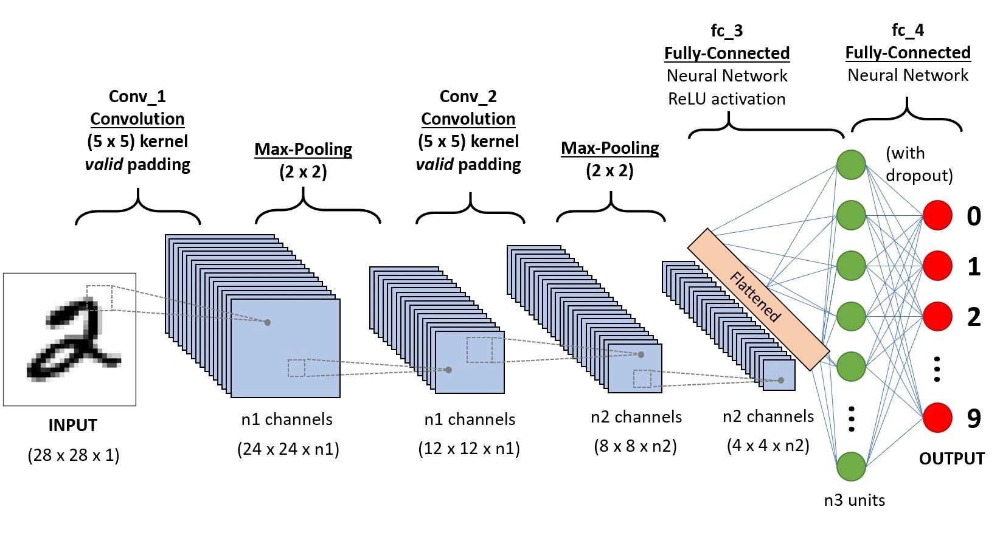

# Convolutional Neural Network

By Braulio Nayap Maldonado Casilla

Una **Red Neuronal Convolucional** (CNN, por sus siglas en inglés) es un tipo de arquitectura de red neuronal especialmente diseñada para procesar datos con una estructura de tipo rejilla, como imágenes. Las CNN son ampliamente utilizadas en tareas de visión por computadora debido a su capacidad para extraer automáticamente características relevantes del input sin necesidad de preprocesamiento manual. Estas redes utilizan operaciones convolucionales para detectar patrones locales, seguidas de técnicas como pooling para reducir la dimensionalidad y mejorar la eficiencia. Posteriormente, las representaciones obtenidas son aplanadas y procesadas por capas totalmente conectadas (MLP) para realizar la clasificación o predicción. A continuación, se explicarán sus principales componentes: capas convolucionales, de agrupamiento (pooling), de aplanamiento (flatten) y perceptrones multicapa (MLP).



## Convolución

Es una operación fundamental en redes neuronales convolucionales (CNN) que permite extraer patrones locales de una entrada multidimensional, como imágenes. Consiste en aplicar pequeños filtros (o kernels) que recorren la entrada realizando productos punto en regiones locales, generando mapas de características que capturan bordes, texturas y otras estructuras. Esta operación reduce la cantidad de parámetros y mejora la eficiencia en el aprendizaje de representaciones jerárquicas.

### Fórmula de la convolución discreta 2D

La salida en la posición (i, j) del canal de salida c_out, aplicando una convolución sobre una entrada multicanal, se calcula como:


| Símbolo              | Significado                                                  |
| -------------------- | ------------------------------------------------------------ |
| Y_c_out (i, j)       | Valor en la posición (i,j) del canal de salida c_out         |
| X_c_in (i,j)         | Valor en la posición (i,j) del canal de entrada c_in         |
| K_c_out, c_in (m, n) | Valor del kernel que conecta c_in => c_out en posición (m,n) |
| b_c_out              | Sesgo (bias) correspondiente al canal de salida c_out        |
| S                    | Stride (paso de desplazamiento)                              |
| P                    | Padding (relleno con ceros alrededor de la entrada)          |
| C_in                 | Número de canales de entrada                                 |
| C_out                | Número de filtros / canales de salida                        |
| K_H, K_W             | Altura y ancho del kernel                                    |

### Fórmulas para calcular el tamaño de salida de la convolución

Dada una entrada tridimensional de tamaño:


y una convolución definida por:

- Kernel de tamaño K_H x K_W
- Stride S
- Padding P
- Número de filtros C_out

El tamaño de la salida será:


| Símbolo | Significado                                       |
| ------- | ------------------------------------------------- |
| C_in    | Número de canales de la entrada (ej. 3 si es RGB) |
| H_in    | Altura (filas) de la entrada                      |
| W_in    | Ancho (columnas) de la entrada                    |
| K_H     | Altura del kernel (filtro)                        |
| K_W     | Ancho del kernel (filtro)                         |
| P       | Padding (número de ceros añadidos en los bordes)  |
| S       | Stride (paso con el que se desplaza el filtro)    |
| C_out   | Número de filtros (canales de salida)             |
| H_out   | Altura del mapa de características de salida      |
| W_out   | Ancho del mapa de características de salida       |
| ⌊⌋      | Parte entera inferior (redondeo hacia abajo)      |

### Funciones de activación en la salida de la convolución

Después de aplicar la convolución, se utiliza una **función de activación** para introducir no linealidad en el modelo. Esto permite que la red aprenda relaciones más complejas que una combinación lineal de entradas. Las funciones de activación más comunes son:


- **ReLU (Rectified Linear Unit)**: convierte los valores negativos en cero, permitiendo una propagación eficiente del gradiente. Se usa por defecto en la mayoría de las capas convolucionales.
- **Sigmoide**: transforma los valores en el rango (0, 1), útil en tareas de clasificación binaria, pero puede causar saturación en redes profundas.
- **Tanh**: mapea los valores entre (-1, 1), útil cuando se desea que la salida esté centrada en cero, aunque también puede saturarse.

Cada función se elige según la tarea: **ReLU** es la más común en capas ocultas, mientras que **sigmoide** o **tanh** pueden usarse en la capa de salida o en arquitecturas específicas.

---

## Pooling

Es una operación que se aplica a los mapas de características (feature maps) generados por la convolución para reducir sus dimensiones espaciales (alto y ancho). Esta reducción ayuda a disminuir la cantidad de parámetros, reducir el costo computacional y controlar el overfitting. Además, permite que la red sea más robusta a pequeñas translaciones y deformaciones en la entrada.

A diferencia de la convolución, el pooling no tiene pesos entrenables. En su lugar, aplica una función de agregación (como máximo, promedio o mínimo) sobre regiones locales del mapa de características.

### Fórmula del pooling 2D

La salida en la posición `(i, j)` del canal `c`, aplicando una operación de pooling sobre una entrada, se calcula como:


La función `POOL` puede ser `max`, `avg` o `min`, y se aplica sobre una región de tamaño K_H x K_W.

| Símbolo   | Significado                                          |
| --------- | ---------------------------------------------------- |
| Y_c(i, j) | Valor en la posición (i,j) del canal de salida `c`   |
| X_c       | Canal de entrada                                     |
| K_H, K_W  | Altura y ancho de la ventana de pooling              |
| S         | Stride (paso con el que se desplaza la ventana)      |
| P         | Padding (ceros añadidos en los bordes de la entrada) |
| POOL      | Operación de agregación (máximo, promedio o mínimo)  |

### Fórmula para calcular el tamaño de salida del pooling

Dada una entrada tridimensional de tamaño:


Y una operación de pooling definida por:

- Tamaño de ventana K_H x K_W
- Stride `S`
- Padding `P`

El tamaño de la salida será:


| Símbolo  | Significado                                   |
| -------- | --------------------------------------------- |
| C        | Número de canales (no cambia con pooling)     |
| H_in     | Altura de la entrada                          |
| W_in     | Ancho de la entrada                           |
| K_H, K_W | Altura y ancho de la ventana de pooling       |
| P        | Padding (relleno con ceros)                   |
| S        | Stride (paso de desplazamiento de la ventana) |
| H_out    | Altura del mapa de características de salida  |
| W_out    | Ancho del mapa de características de salida   |
| ⌊ ⌋      | Parte entera inferior (redondeo hacia abajo)  |

### Tipos de pooling

| Tipo de pooling     | Descripción                                                                                                    |
| ------------------- | -------------------------------------------------------------------------------------------------------------- |
| **Max pooling**     | Toma el valor máximo de cada región. Resalta las características más fuertes y es el más común en CNNs.        |
| **Average pooling** | Calcula el promedio de los valores en cada región. Suaviza la representación y se usa para resúmenes globales. |
| **Min pooling**     | Toma el valor mínimo de cada región. Es menos común, útil en contextos donde interesa conservar mínimos.       |

---

## Flatten

La operación **Flatten** (aplanamiento) transforma una entrada multidimensional (por ejemplo, un tensor 3D de una imagen con canales, alto y ancho) en un **vector unidimensional**. Es una operación común en redes convolucionales justo antes de conectar con capas densas (**fully connected**), que esperan vectores como entrada en lugar de tensores.

Flatten **no modifica los valores** del tensor, solo cambia su forma (shape), reorganizando los datos en un único vector.

Este permite conectar las salidas de capas convolucionales (2D o 3D) con una o más capas totalmente conectadas (densas). Así, permite que las características extraídas espacialmente por la red sean procesadas por una red neuronal clásica para tareas como clasificación.

### Fórmula para el tamaño de salida

Si la entrada tiene dimensiones (C,H,W) ,entonces, después del flatten, el tamaño de salida será:


Es decir, se convierte en un vector de dimensión 1D:


| Símbolo | Significado                                       |
| ------- | ------------------------------------------------- |
| C       | Número de canales (depth)                         |
| H       | Altura del mapa de características                |
| W       | Ancho del mapa de características                 |
| ×       | Multiplicación para obtener el tamaño total plano |

---

## MLP

El **MLP (Perceptrón Multicapa)** es un tipo de red neuronal artificial compuesta por múltiples capas de neuronas organizadas jerárquicamente. A diferencia del perceptrón simple, el MLP puede aprender representaciones no lineales gracias a sus capas ocultas y al uso de funciones de activación no lineales como la sigmoide, la ReLU o la tangente hiperbólica. Estas características lo hacen especialmente adecuado para resolver problemas complejos como la clasificación no lineal, por ejemplo, el problema clásico de la compuerta XOR.

---

## Ejecución

Para compilar y ejecutar el proyecto, simplemente usa:

```bash
make run
```

Antes de entrenar, asegúrate de descargar los datasets necesarios desde los siguientes enlaces:

- [**MNIST**](https://github.com/ShinjiMC/Convolutional-Neural-Network/releases/download/CNN_FASHION/MNIST_dataset.tar.gz)
- [**FashionMNIST**](https://github.com/ShinjiMC/Convolutional-Neural-Network/releases/download/CNN_FASHION/FASHION_dataset.tar.gz)

Una vez descargados, descomprime los archivos y colócalos en el directorio `database/`. Por ejemplo:

```bash
tar -xvzf MNIST_dataset.tar.gz -C database/
tar -xvzf FASHION_dataset.tar.gz -C database/
```

Luego podrás ejecutar el entrenamiento con el siguiente comando, por ejemplo para FashionMNIST:

```bash
./build/cnn_train --dataset ./database/FASHION --epochs 20 --config ./config/fashion.txt
```

Esto iniciará el proceso de entrenamiento y mostrará la salida por consola:


---

## Comparación de resultados

Se utilizó la siguiente arquitectura convolucional para el experimento con CNN:

```text
Conv2D:     [3,28,28]  → [16,28,28]
MaxPooling: [16,28,28] → [16,14,14]
Conv2D:     [16,14,14] → [4,14,14]
MaxPooling: [4,14,14]  → [4,7,7]
Flatten:    [4,7,7]    → [1,196]
MLP:
  Dropout: 0.2
  L2: 0.01
  Optimizer: SGD (lr = 0.002)
  Layer: 196 → 16 (ReLU)
  Layer: 16 → 10 (Softmax)
```

El entrenamiento de esta arquitectura generó el siguiente gráfico:


Adicionalmente, se entrenó una versión basada únicamente en MLP para observar la diferencia de desempeño. Esta arquitectura fue implementada en el repositorio [MLP-MNIST](https://github.com/ShinjiMC/MLP-MNIST):

```text
MLP:
  Dropout: 0.2
  L2: 0.01
  Optimizer: SGD (lr = 0.002)
  Layer: 784 → 16 (ReLU)
  Layer: 16 → 10 (Softmax)
```

Resultados del entrenamiento:


Gráfico comparativo del desempeño:


---

## Análisis de Resultados

Se compararon dos arquitecturas: una red **CNN** y una red **MLP simple** sobre el dataset **FashionMNIST**. A continuación se muestra una tabla con los valores más representativos del entrenamiento (epochs seleccionados por inicio, medio y mejores resultados):

| Epoch | Modelo | Train Loss | Train Acc (%) | Test Acc (%) | Train Time (s) | Test Time (s) |
| ----- | ------ | ---------- | ------------- | ------------ | -------------- | ------------- |
| 1     | CNN    | 1.0646     | 72.77         | 72.58        | 217.82         | 12.15         |
| 1     | MLP    | 1.2224     | 72.68         | 72.39        | 0.92           | 0.05          |
| 6     | CNN    | 0.7534     | 74.49         | 74.55        | 217.14         | 12.12         |
| 6     | MLP    | 1.0280     | 78.74         | 78.01        | 1.10           | 0.05          |
| 9     | CNN    | 0.7518     | 75.45         | **75.28**    | 217.93         | 12.12         |
| 9     | MLP    | 1.0256     | 78.72         | 77.71        | 1.10           | 0.05          |
| 10    | CNN    | 0.7519     | 75.26         | 74.96        | 216.65         | 12.19         |
| 10    | MLP    | 1.0208     | 77.74         | 77.03        | 0.98           | 0.05          |
| 17    | CNN    | 0.7500     | 75.14         | 75.13        | 218.11         | 12.41         |
| 14    | MLP    | 1.0223     | 79.52         | **78.95**    | 0.93           | 0.05          |

### Observaciones:

- **Tiempo**: El entrenamiento de la CNN toma aproximadamente **200 veces más tiempo por epoch** en comparación con el MLP, lo cual es esperable por la complejidad computacional de las convoluciones.
- **Precisión**: Aunque el MLP alcanza una **mayor precisión en el conjunto de prueba** (hasta 78.95%) frente al máximo de la CNN (75.28%), esto se debe más a la **limitada arquitectura CNN** que a una ventaja inherente del MLP.
- **Estancamiento**: La CNN muestra una pérdida y precisión muy estables desde epoch 6, indicando que podría requerir **ajustes en la arquitectura** para seguir aprendiendo.

---

## Conclusión

Las diferencias en rendimiento se deben principalmente al diseño arquitectónico. En este caso, la red CNN reduce prematuramente la dimensionalidad de las características (con un flatten a 196), lo cual puede ocasionar pérdida de información crucial, especialmente en datasets como **FashionMNIST**, cuyas imágenes son más complejas que las de MNIST.

Una mejora esperada sería utilizar un flatten más amplio (por ejemplo, 512 o 1024), permitir una red MLP más profunda al final y más capas de convolución.

## Author

- **ShinjiMC** - [GitHub Profile](https://github.com/ShinjiMC)

## License

This project is licensed under the MIT License. See the [LICENSE](LICENSE) file for details.
